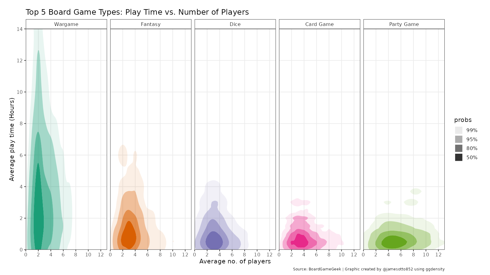
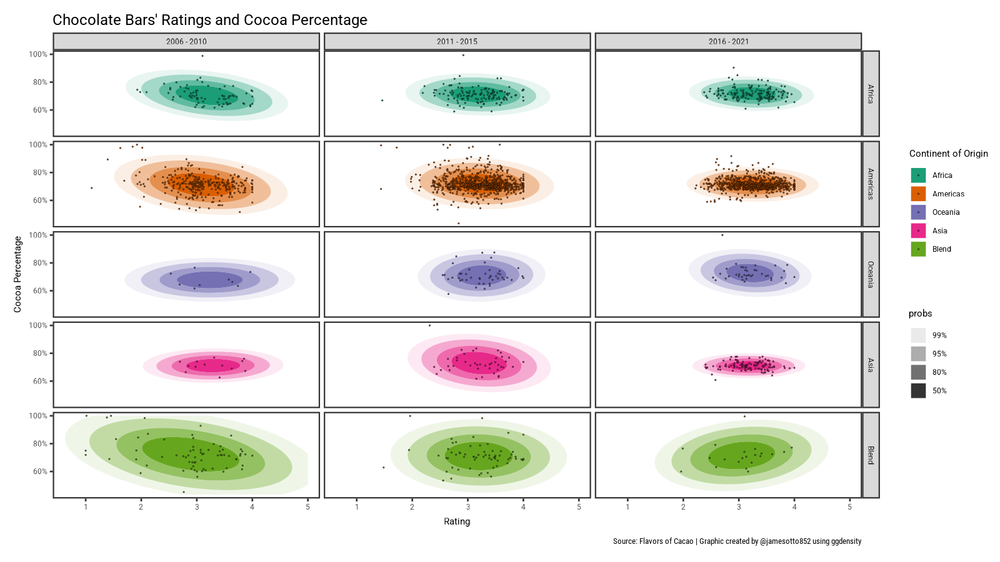

<!-- README.md is generated from README.Rmd. Please edit that file -->

```{r, include = FALSE}
knitr::opts_chunk$set(
  collapse = TRUE,
  comment = "#>"
)
```

# TidyTuesday


This is a repo containing all of the code, graphics, and blog posts I've created for <a href="https://github.com/rfordatascience/tidytuesday">TidyTuesday</a>.
Below, I have included a few examples from the weeks I have participated in.

## Week 2, 2022 -- Bee Colony Losses
<video width="1000" height="433" autoplay loop>
  <source src="2022-01-11-colony/colony.mp4" type="video/mp4">
</video>

## Week 4, 2022 -- BoardGameGeek


## Week 3, 2022 -- Chocolate Bar Ratings



